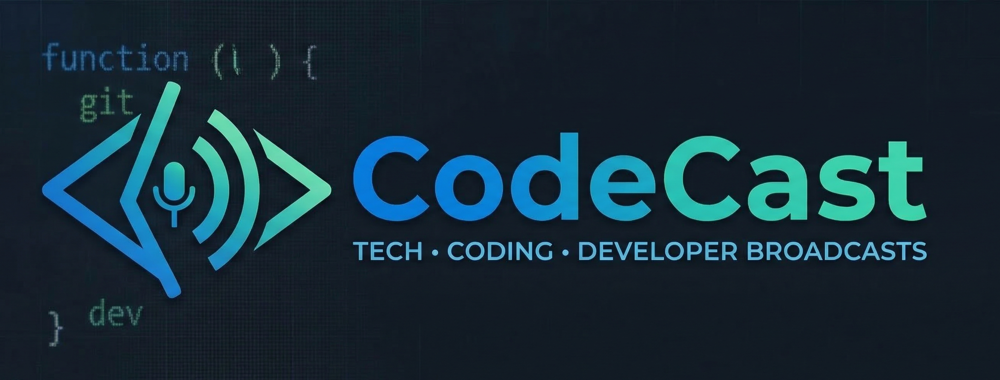

# 🖥️ CodeCast — Realtime Collaborative Code Editor

<div align="center">



**A real-time, multi-user collaborative code editor built with React and Node.js.**

[](https://nodejs.org)
[](https://reactjs.org)
[](https://socket.io)
[](https://docker.com)

</div>

---

## ✨ Features

- ⚡ **Real-time collaboration** — multiple users edit code simultaneously via WebSocket (Socket.io)
- 🌍 **Multi-language support** — C, C++, Python, JavaScript, PHP, HTML, CSS, SQL, Markdown
- 🎨 **Syntax-aware editor** — CodeMirror editor with 15+ themes to choose from
- ▶️ **Code execution** — run code directly from the browser via the built-in execution API
- 📂 **File upload** — upload local source files and inject them into the shared editor
- 🔗 **Room-based sessions** — create or join a room via a unique Room ID
- 🐳 **Docker-ready** — ship it anywhere with the included `Dockerfile`

---

## 🛠️ Tech Stack

| Layer | Technology |
|---|---|
| Frontend | React 18, React Router, Recoil, CodeMirror 5 |
| Backend | Node.js, Express, Socket.io |
| Code Execution | Local `exec` runner (Python, JS, C, C++, PHP) |
| Containerization | Docker |

---

## 🚀 Getting Started

### Prerequisites

- **Node.js** v16 or higher
- **npm** v8+
- (Optional) Python, GCC, Node in `PATH` for local code execution

### 1. Clone the repository

```bash
git clone https://github.com/your-username/codecast.git
cd codecast
```

### 2. Install dependencies

```bash
npm install
```

### 3. Configure environment

Create a `.env` file in the project root (see `.env.example`):

```env
REACT_APP_BACKEND_URL=http://localhost:5000
SERVER_PORT=5000
```

### 4. Start the backend server

```bash
# Development (with hot reload)
npm run server:dev

# Production
npm run server:prod
```

### 5. Start the frontend

```bash
npm start
```

Open [http://localhost:3000](http://localhost:3000) in your browser.

> 💡 **Collaboration tip:** Open the same URL in another tab or share it with a teammate, then join the same Room ID to start collaborating in real time.

---

## 📁 Project Structure

```
codecast/
├── server.js           # Express + Socket.io backend server
├── Dockerfile          # Docker build configuration
├── .env                # Environment variables (gitignored)
├── public/
│   ├── index.html      # HTML entry point
│   ├── logo.png        # App logo
│   └── favicon.ico     # Browser favicon
└── src/
    ├── App.js          # Root React component with routing
    ├── atoms.js        # Recoil global state atoms
    ├── socket.js       # Client-side Socket.io helper
    ├── actions/
    │   └── Actions.js  # Socket event name constants
    ├── components/
    │   ├── Editor.js      # CodeMirror editor component
    │   ├── Client.js      # Connected user avatar component
    │   ├── CodeRunner.js  # Code execution modal
    │   └── FilePreview.js # File upload preview modal
    └── pages/
        ├── Home.js        # Landing page (create/join room)
        └── EditorPage.js  # Main collaborative editor view
```

---

## 🐳 Docker

Build and run the entire application inside a Docker container:

```bash
# Build the image
docker build -t codecast .

# Run the container
docker run -p 5000:5000 codecast
```

The container serves the production React build from `http://localhost:5000`.

---

## 🧪 Development Scripts

| Script | Description |
|---|---|
| `npm start` | Start the React development server |
| `npm run server:dev` | Start the backend with `nodemon` (auto-restart) |
| `npm run server:prod` | Start the backend with `node` |
| `npm run build` | Build the frontend for production |
| `npm run start:docker` | Start both server and frontend (Docker use) |

---

## ⚠️ Notes & Limitations

- **Code execution** runs directly on the host machine. Ensure Python, Node, or GCC are installed and available in your `PATH` to execute the respective languages.
- **Security:** The `/api/execute` endpoint runs arbitrary code. **Do not expose this to the public internet** without proper sandboxing. This project is intended for local/team use.
- **CORS:** The backend is currently configured to allow all origins (`*`). For production, update the `cors` config in `server.js` to your specific domain.

---

## 🤝 Contributing

Contributions are welcome!

1. Fork the repository
2. Create your feature branch: `git checkout -b feature/my-feature`
3. Commit your changes: `git commit -m 'feat: add my feature'`
4. Push to the branch: `git push origin feature/my-feature`
5. Open a Pull Request

---

## 📄 License

This project is open-source. Feel free to use, modify, and distribute it.
